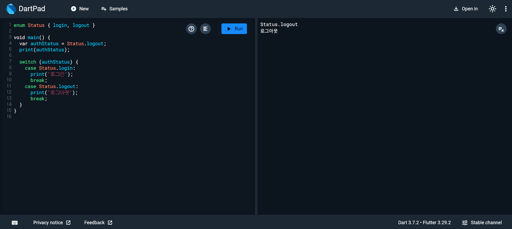
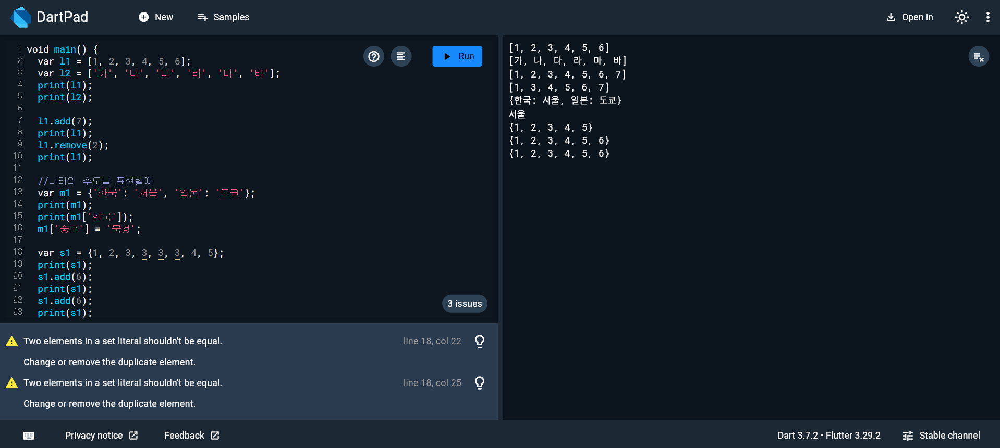
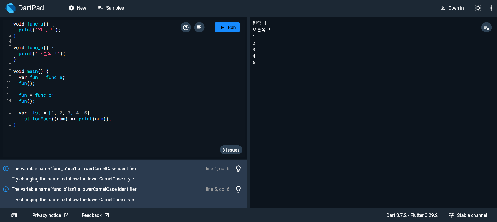

# Flutter_03-2
Android Studio & Flutter SDK
- Android Studio Meerkat | 2024.3.1 Windows
- Flutter_windows_3.29.1-stable
- https://dartpad.dev/

## 실습 내용
Dart 문법을 연습할수있는 [dartpad.dev](https://dartpad.dev/)를 활용하여 다양한 객체 지향 프로그래밍 코드 연습해보기

### 실습 예제 4

작성 코드
<pre>
<code>
enum Status { login, logout }

void main() {
  var authStatus = Status.logout;
  print(authStatus);

  switch (authStatus) {
    case Status.login:
      print('로그인');
      break;
    case Status.logout:
      print('로그아웃');
      break;
  }
}
</code>
</pre>

#### 실행 결과

### 실습 예제 5

작성 코드
<pre>
<code>
void main() {
  var l1 = [1, 2, 3, 4, 5, 6];
  var l2 = ['가', '나', '다', '라', '마', '바'];
  print(l1);
  print(l2);

  l1.add(7);
  print(l1);
  l1.remove(2);
  print(l1);

  //나라의 수도를 표현할때
  var m1 = {'한국': '서울', '일본': '도쿄'};
  print(m1);
  print(m1['한국']);
  m1['중국'] = '북경';

  var s1 = {1, 2, 3, 3, 3, 3, 4, 5};
  print(s1);
  s1.add(6);
  print(s1);
  s1.add(6);
  print(s1);
}
</code>
</pre>

#### 실행 결과

 
### 실습 예제 6

작성 코드
<pre>
<code>
void func_a() {
  print('왼쪽 !');
}

void func_b() {
  print('오른쪽 !');
}

void main() {
  var fun = func_a;
  fun();

  fun = func_b;
  fun();

  var list = [1, 2, 3, 4, 5];
  list.forEach((num) => print(num));
}
</code>
</pre>

#### 실행 결과

