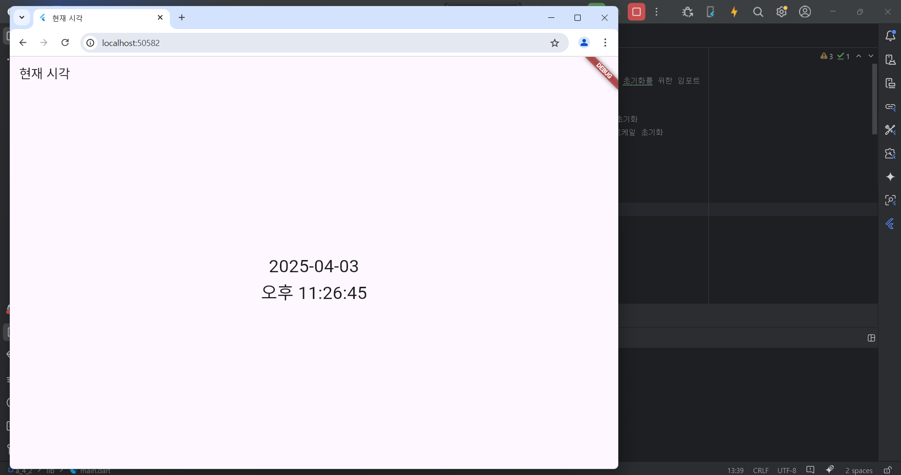
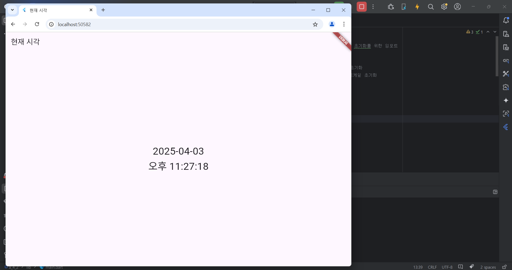

# Flutter_04-3
Android Studio & Flutter SDK
- Android Studio Meerkat | 2024.3.1 Windows
- Flutter_windows_3.29.1-stable
- https://dartpad.dev/

## 실습 내용
Android Studio 와 Flutter 를 활용하여 화면상단에 현재 시간 문구 출력, 중간에 현재 시각을 표시(현재 시각은 1초마다 갱신)하는 프로그램 코딩

프로그램을 실행하기 위해 intl 패키지 설치(터미널에서 flutter pub add intl 명령어 실행 후 flutter pub get 명령어 실행)

작성 코드

<pre>
<code>
import 'package:flutter/material.dart';
import 'package:intl/intl.dart';
import 'package:intl/date_symbol_data_local.dart'; // ← 로케일 초기화를 위한 임포트

void main() async {
  WidgetsFlutterBinding.ensureInitialized(); // Flutter 엔진 초기화
  await initializeDateFormatting('ko_KR', null); // ← 한국어 로케일 초기화
  runApp(MyApp());
}

class MyApp extends StatelessWidget {
  @override
  Widget build(BuildContext context) {
    return MaterialApp(
      title: '현재 시각',
      home: ClockScreen(),
    );
  }
}

class ClockScreen extends StatefulWidget {
  @override
  _ClockScreenState createState() => _ClockScreenState();
}

class _ClockScreenState extends State<ClockScreen> {
  String _time = '';

  @override
  void initState() {
    super.initState();
    _updateTime(); // 앱 시작 시 초기 시간 설정
    // 1초마다 현재 시간 갱신
    Stream.periodic(Duration(seconds: 1)).listen((_) => _updateTime());
  }

  void _updateTime() {
    final now = DateTime.now();
    final date = DateFormat('yyyy-MM-dd').format(now); // 날짜
    final time = DateFormat('a h:mm:ss', 'ko_KR').format(now); // 오전/오후 시간

    setState(() {
      _time = '$date\n$time';
    });
  }

  @override
  Widget build(BuildContext context) {
    return Scaffold(
      appBar: AppBar(title: Text('현재 시각')),
      body: Center(
        child: Text(
          _time,
          style: TextStyle(fontSize: 30),
          textAlign: TextAlign.center,
        ),
      ),
    );
  }
}
</code>
</pre>

#### 실행 결과

