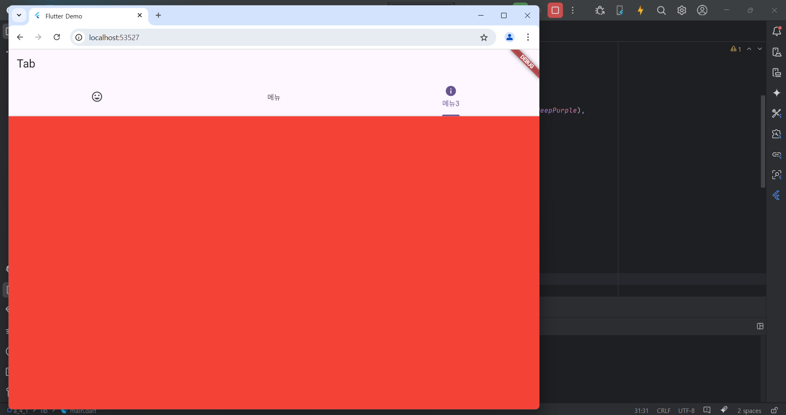

# Flutter_05-5
Android Studio & Flutter SDK
- Android Studio Meerkat | 2024.3.1 Windows
- Flutter_windows_3.29.1-stable
- https://dartpad.dev/

## 실습 내용
Android Studio 와 Flutter 를 활용하여 화면에 버튼(아이콘)과 색상 출력 후 클릭해보기    
(클릭시 각 메뉴에 따라 아래 색상이 변경됌)

작성 코드

<pre>
<code>
import 'package:flutter/material.dart';

void main() {
  runApp(const MyApp());
}

class MyApp extends StatelessWidget {
  const MyApp({super.key});

  @override
  Widget build(BuildContext context) {
    return MaterialApp(
      title: 'Flutter Demo',
      theme: ThemeData(
        colorScheme: ColorScheme.fromSeed(seedColor: Colors.deepPurple),
      ),
      home: MyHomePage(),
    );
  }
}
class MyHomePage extends StatelessWidget {
  final items = List.generate(100, (i) => i).toList();

  @override
  Widget build(BuildContext context) {
    return DefaultTabController(
      length: 3,
      child : Scaffold(
        appBar : AppBar(
          title: Text('Tab'),
          bottom :TabBar(
            tabs: [
              Tab(icon : Icon(Icons.tag_faces)),
              Tab(text: '메뉴'),
              Tab(icon : Icon(Icons.info), text:'메뉴3'),
            ],
          )
        ),
          body : TabBarView(
            children: [
              Container(color : Colors.yellow),
              Container(color : Colors.orange),
              Container(color : Colors.red),
            ],
          )
        )
      );
  }
}

</code>
</pre>

#### 실행 결과

