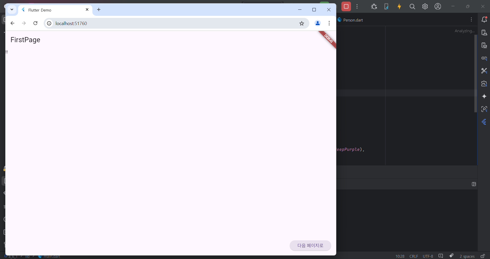

# Flutter_06-1
Android Studio & Flutter SDK
- Android Studio Meerkat | 2024.3.1 Windows
- Flutter_windows_3.29.1-stable
- https://dartpad.dev/

## 실습 내용
Android Studio 와 Flutter 를 활용하여 화면에 텍스트와 버튼 출력 후 버튼 클릭시 다음페이지로 이동, 다시 클릭시 이전페이지로 이동하는 프로그램 코딩 후 실행해보기

main.dart 작성 코드

<pre>
<code>
import 'package:flutter/material.dart';
import 'package:a_6_1/first_page.dart';
import 'package:a_6_1/second_page.dart';

void main() {
  runApp(const MyApp());
}

class MyApp extends StatelessWidget {
  const MyApp({super.key});

  // This widget is the root of your application.
  @override
  Widget build(BuildContext context) {
    return MaterialApp(
      title: 'Flutter Demo',
      theme: ThemeData(
        colorScheme: ColorScheme.fromSeed(seedColor: Colors.deepPurple),
      ),
      home: const FirstPage(),
      routes: {
        '/first' : (context) => FirstPage(),
        '/second' : (context) => SecondPage(),
      },
    );
  }
}

</code>
</pre>

first_page.dart 작성 코드

<pre>
<code>
import 'package:flutter/material.dart';
import 'package:a_6_1/second_page.dart';
import 'package:a_6_1/Person.dart';

class FirstPage extends StatelessWidget {
  const FirstPage({super.key});

  // This widget is the root of your application.
  @override
  Widget build(BuildContext context) {
    return Scaffold(
      appBar: AppBar(title: Text('FirstPage')),
      body: Text('!!'),
      floatingActionButton: ElevatedButton(
        onPressed:
            () async {
          final person = Person('홍길동', 20);
              var result = await Navigator.push(
                context,
                MaterialPageRoute(builder: (context) => SecondPage(person: person)),

              );
            },
        child: Text('다음 페이지로'),
      ),
    );
  }
}

</code>
</pre>

second_page .dart 작성 코드

<pre>
<code>
import 'package:flutter/material.dart';
import 'package:a_6_1/Person.dart';

class SecondPage extends StatelessWidget {
  final Person? person;

  const SecondPage({super.key, this.person});

  // This widget is the root of your application.
  @override
  Widget build(BuildContext context) {
    return Scaffold(
      appBar: AppBar(title: Text('SecondpagePage')),
      body: Text('${person?.name}, ${person?.age}'),
      floatingActionButton: ElevatedButton(
        onPressed: () {
          Navigator.pop(context, "동작했음 !");
        },
        child: Text('이전 페이지로'),
      ),
    );
  }
}

</code>
</pre>

Person.dart 작성 코드

<pre>
<code>
class Person{
  String name;
  int age;

  Person(this.name, this.age);
}
</code>
</pre>

#### 실행 결과

