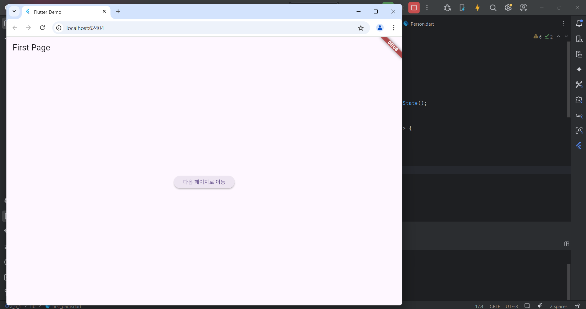
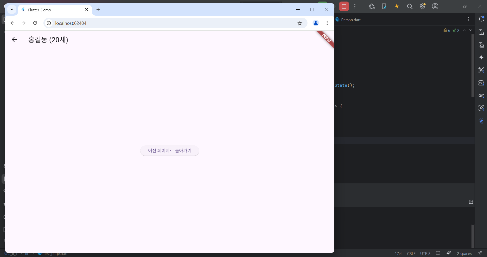
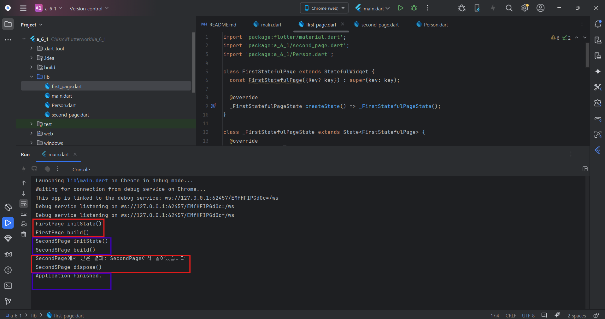

# Flutter_06-1
Android Studio & Flutter SDK
- Android Studio Meerkat | 2024.3.1 Windows
- Flutter_windows_3.29.1-stable
- https://dartpad.dev/

## 실습 내용
Android Studio 와 Flutter 를 활용하여 화면에 텍스트와 버튼 출력 후 작동하면서 생명주기 확인, 로그를 출력해보기

main.dart 작성 코드

<pre>
<code>
import 'package:flutter/material.dart';
import 'package:a_6_1/first_page.dart';

void main() {
  runApp(const MyApp());
}

class MyApp extends StatelessWidget {
  const MyApp({super.key});

  @override
  Widget build(BuildContext context) {
    return MaterialApp(
      title: 'Flutter Demo',
      theme: ThemeData(
        colorScheme: ColorScheme.fromSeed(seedColor: Colors.deepPurple),
      ),
      home: const FirstStatefulPage(), // 첫 페이지로 진입
    );
  }
}

</code>
</pre>

first_page.dart 작성 코드

<pre>
<code>
import 'package:flutter/material.dart';
import 'package:a_6_1/second_page.dart';
import 'package:a_6_1/Person.dart';

class FirstStatefulPage extends StatefulWidget {
  const FirstStatefulPage({Key? key}) : super(key: key);

  @override
  _FirstStatefulPageState createState() => _FirstStatefulPageState();
}

class _FirstStatefulPageState extends State<FirstStatefulPage> {
  @override
  void initState() {
    super.initState();
    print('FirstPage initState()');
  }

  @override
  void dispose() {
    print('FirstPage dispose()');
    super.dispose();
  }

  @override
  Widget build(BuildContext context) {
    print('FirstPage build()');
    return Scaffold(
      appBar: AppBar(title: const Text('First Page')),
      body: Center(
        child: ElevatedButton(
          onPressed: () async {
            final person = Person('홍길동', 20);
            final result = await Navigator.push(
              context,
              MaterialPageRoute(
                builder: (context) => SecondStatefulPage(person: person),
              ),
            );
            print('SecondPage에서 받은 결과: $result');
          },
          child: const Text('다음 페이지로 이동'),
        ),
      ),
    );
  }
}

</code>
</pre>

second_page .dart 작성 코드

<pre>
<code>
import 'package:flutter/material.dart';
import 'package:a_6_1/Person.dart';

class SecondStatefulPage extends StatefulWidget {
  final Person person;

  const SecondStatefulPage({Key? key, required this.person}) : super(key: key);

  @override
  _SecondStatefulPageState createState() => _SecondStatefulPageState();
}

class _SecondStatefulPageState extends State<SecondStatefulPage> {
  @override
  void initState() {
    super.initState();
    print('SecondSPage initState()');
  }

  @override
  void dispose() {
    print('SecondSPage dispose()');
    super.dispose();
  }

  @override
  Widget build(BuildContext context) {
    print('SecondSPage build()');
    return Scaffold(
      appBar: AppBar(
        title: Text('${widget.person.name} (${widget.person.age}세)'),
      ),
      body: Center(
        child: ElevatedButton(
          onPressed: () {
            Navigator.pop(context, 'SecondPage에서 돌아왔습니다');
          },
          child: const Text('이전 페이지로 돌아가기'),
        ),
      ),
    );
  }
}

</code>
</pre>

Person.dart 작성 코드

<pre>
<code>
class Person {
  final String name;
  final int age;

  const Person(this.name, this.age);
}

</code>
</pre>

#### 실행 결과

