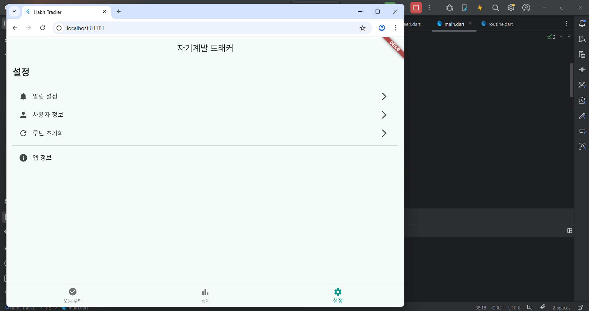
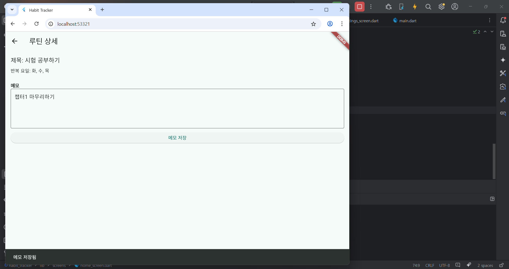

# 📝 자기계발 미션 트래커 프로젝트 계획서

---

### 1. (9주차)프로젝트 개요

- **프로젝트명**: 미정
- **목표**: 사용자가 자기계발 습관을 설정하고, 매일의 실천 여부를 기록·시각화할 수 있는 웹 기반 앱 구현
- **개발 플랫폼**: Flutter Web
- **핵심 기능**:
  - 루틴 생성 및 반복 요일 설정
  - 달성 체크 UI (체크박스 or 스위치)
  - 달성률 시각화 (달력 / 그래프)
  - 연속 달성 보상 뱃지 시스템

---

### 2. 사용 개발환경 및 참고사항

#### Android Studio & Flutter SDK
- Android Studio Meerkat | 2024.3.1 (Windows)
- Flutter_windows_3.29.1-stable

#### LLM 활용도구
- ChatGPT-4o
- Microsoft Copilot

---

### 3. 주차 별 진행 계획

| 주차    | 진행 내용                                |
|---------|-------------------------------------------|
| 9주차   | 프로젝트 계획서 작성                      |
| 10주차  | 요구사항 정의, 기획/설계, 개발환경 설정    |
| 11주차  | 기능 개발 (레이아웃 구현)                |
| 12주차  | 기능 개발 (기본 기능 개발)               |
| 13주차  | 기능 개발 (세부 기능 및 UI 보강)         |
| 14주차  | 테스트 및 수정사항 반영, 배포 준비       |
| 15주차  | 최종 완성 및 발표                         |

---

### 4. 리소스 계획

| 항목        | 내용                                     |
|-------------|------------------------------------------|
| 개발 툴     | Flutter SDK, Dart, VS Code, Android Studio |
| 디자인      | Flutter 위젯 UI, 필요 시 Figma 사용        |
| 저장소      | Hive (로컬), Firebase (선택) - 확정 X       |
| 배포        | Firebase Hosting, GitHub Pages - 확정 X    |
| 문서화 도구 | GitHub Wiki, Markdown (.md), PPT          |

---

### 5. 리스크 관리

| 리스크 요소           | 대응 방안                                       |
|------------------------|------------------------------------------------|
| 일정 지연 가능성       | 주요 마일스톤 설정 및 주간 점검으로 일정 조절 |
| 기능 구현 난이도       | MVP 우선 구현 → 차후 확장 기능 추가             |
| 배포 실패              | 로컬 테스트 선행, GitHub Pages 백업 준비         |
| UI 설계 오류 가능성    | 피그마/스케치로 시안 작성 및 조기 테스트 반영     |

---

### 6. 커뮤니케이션 계획

- **버전관리**: GitHub를 통한 기능별 브랜치 및 커밋 이력 관리
- **작업기록 공유**: Google Docs, Notion으로 To-do 관리
- **중간 점검 및 회고**: 매주 업무 리뷰 및 리비전 반영
- **최종 제출자료**: 발표용 PPT + 코드 저장소 링크 + 최종 문서

---

## (10주차)자기계발 미션 트래커 - 기획/설계 및 개발환경 설정

### 1. 기획 / 설계

#### 1-1. 앱 화면 목록 (App Screens)

| 화면 이름 | 설명 |
|-----------|------|
| 홈 화면(Home) | 오늘의 루틴 리스트 & 체크 UI |
| 루틴 등록 화면 | 루틴 이름, 반복 요일 설정 |
| 통계 화면 | 달성 이력 달력, 그래프 등 시각화 |
| 설정 화면 | 알림 설정, 초기화 등 (선택) |

---

#### 1-2. 기능 흐름도 (기본 로직)

[홈 화면]   
└─ 오늘 루틴 조회 → 체크 여부 표시 (체크박스 클릭) → Hive에 저장

[루틴 등록 화면]   
└─ 이름 입력 + 반복 요일 선택 → 저장 → 홈에 반영

[통계 화면]   
└─ 일자별 완료 여부 → 달력에 시각화 → 루틴별 성공률 계산

[뱃지 시스템]   
└─ 연속 성공 여부 감지 → 뱃지 발급 → UI에 표시 (선택적 MVP)

---

#### 1-3. 데이터 모델 설계

---

#### 1-4. 저장소 구조 설계

| Box 이름      | 저장 데이터                         |
|---------------|--------------------------------------|
| `routinesBox` | 루틴 리스트 (`Routine` 객체)         |
| `dailyBox`    | 일별 체크 데이터 (`DailyRecord` 객체) |
| `badgeBox`    | 획득한 뱃지 리스트 (`Badge` 객체)     |

---

#### 1-5. MVP 스펙 정의

| 기능               | 포함 여부                  |
|--------------------|----------------------------|
| 루틴 등록/삭제     | ✅                         |
| 반복 요일 설정     | ✅                         |
| 일별 체크 기능     | ✅                         |
| 달력 기반 통계     | ✅                         |
| 뱃지 시스템         | ❌ (차후 구현 예정)        |

---

### 2. 개발환경 설정

#### 2-1. 사용 프로그램

Android Studio Meercat 2024.3.1 patch 2
Flutter_windows_3.29.1-stable

---

#### 2-2. 디렉토리 구조 예시

lib/   
├── main.dart   
├── models/   
│ └── routine.dart   
├── screens/   
│ ├── home_screen.dart   
│ ├── add_routine_screen.dart   
│ └── stats_screen.dart   
├── widgets/   
│ └── routine_card.dart   
└── services/   
└── storage_service.dart   

---

#### 2-3. 의존성 패키지 추가 (pubspec.yaml)

<pre>
<code>
dependencies:
  flutter:
    sdk: flutter
  hive: ^2.2.3
  hive_flutter: ^1.1.0
  path_provider: ^2.0.11
  table_calendar: ^3.0.9
  provider: ^6.1.1
</code>
</pre>

---

## 요구사항 정의

### 내가 생각하는 요구사항 (제작자 관점)

| 번호 | 요구사항 설명 |
|------|----------------|
| 1 | 사용자가 매일 체크할 루틴을 직접 등록하고 요일을 선택할 수 있어야 한다. |
| 2 | 실천 여부를 한눈에 체크할 수 있는 UI(체크박스 또는 스위치)를 제공해야 한다. |
| 3 | 루틴 달성률이나 이력은 달력이나 그래프로 시각적으로 표현되어야 한다. |

---

### 다른 사람이 생각하는 요구사항 (친구/지인 관점)

| 번호 | 요구사항 설명 |
|------|----------------|
| 1 | 루틴 등록이 간편하고 직관적으로 이루어져야 한다. (예: 추천 루틴 제공) |
| 2 | 동기부여를 위한 피드백 또는 보상 시스템이 있으면 좋겠다. (예: 칭찬 메시지, 뱃지 등) |
| 3 | 루틴 실패나 미달성도 기록되어야 한다. (실패도 자기인식에 중요하므로) |

---

### LLM이 생각하는 요구사항 (AI 관점)

| 번호 | 요구사항 설명 |
|------|----------------|
| 1 | 루틴은 사용자가 설정한 반복 요일에만 체크할 수 있어야 한다. |
| 2 | 데이터는 로컬에 안전하게 저장되고, 로그인 없이도 기본 기능을 사용할 수 있어야 한다. |
| 3 | 사용하지 않는 오래된 루틴은 자동으로 아카이브 처리되어야 한다. |

---

## (11주차)기본 레이아웃

### 기본 레이아웃 구성

---

main.dart 화면 내 하단 네비게이션 바의 버튼을 정의, 세 개의 화면 레이아웃 구성
 
   
home_screen.dart   
└─ add_routine_screen.dart   
stats_screen.dart   
settings_screen.dart

---

### 각 화면 초기 레이아웃 구성 모습

home_screen.dart 

add_routine_screen.dart

stats_screen.dart

settings_screen.dart

---

## (12주차)기능구현 

### 기본 기능 개발 

home_screen.dart 화면 내 루틴 등록 시 나오는 화면 정리, 등록 루틴 삭제 기능 추가   
└─ 등록 루틴 클릭 시 메모 등록 기능 추가

stats_screen.dart 화면 내 달력 구현(dependencies: table_calendar: ^3.0.9) 및 달성률 시각화

---

### 기본 기능 구현 모습

home_screen.dart

stats_screen.dart

---

