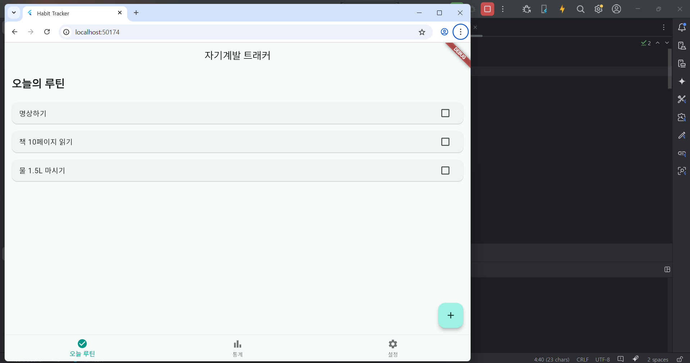
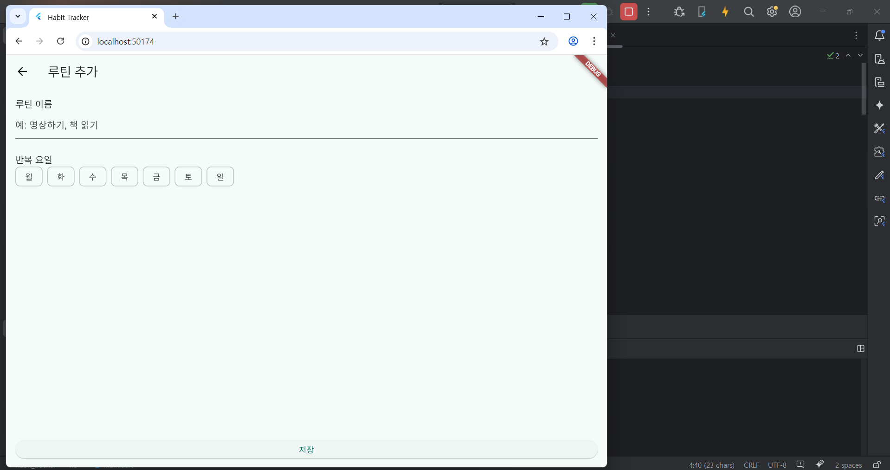
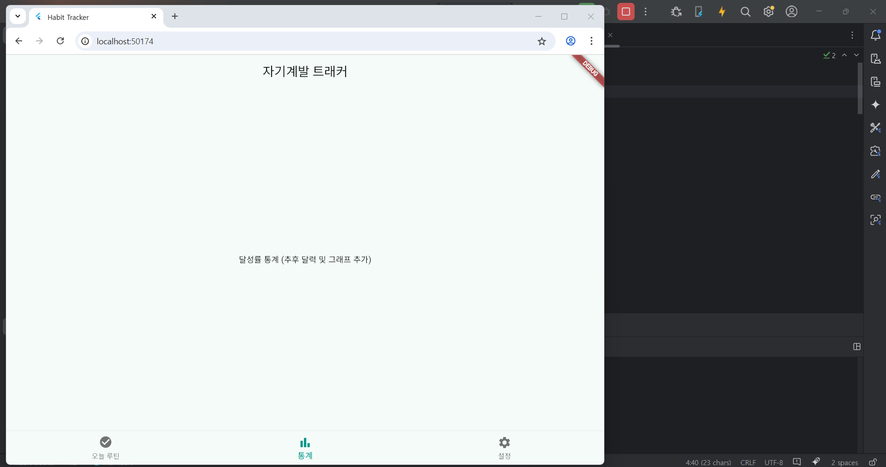

# 📋 기본 레이아웃

---

## ✅ 기본 레이아웃 구성

main.dart 화면 내 하단 네비게이션 바의 버튼을 정의, 세 개의 화면 레이아웃 구성   
   
home_screen.dart   
└─ add_routine_screen.dart   
stats_screen.dart   
(설정 부분은 추후 구현)

---

## 각 화면 초기 레이아웃 구성 모습

home_screen.dart 

add_routine_screen.dart

stats_screen.dart

