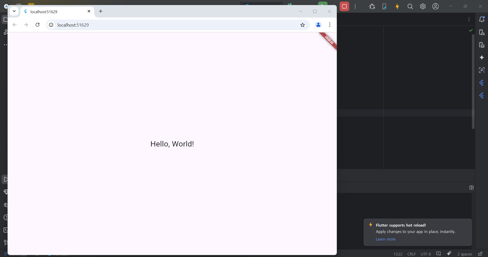

# Flutter_01
Android Studio & Flutter SDK
- Android Studio Meerkat | 2024.3.1 Windows
- Flutter_windows_3.29.1-stable

## 실습 내용
Android Studio 와 Flutter SDK 개발환경 구축 후 화면에 Hello World 출력되게 코딩

작성 코드
<pre>
<code>
import 'package:flutter/material.dart';

void main() {
  runApp(const MyApp());
}

class MyApp extends StatelessWidget {
  const MyApp({super.key});

  @override
  Widget build(BuildContext context) {
    return const MaterialApp(
      home: Scaffold(
        body: Center(
          child: Text(
            'Hello, World!',
            style: TextStyle(fontSize: 24),
          ),
        ),
      ),
    );
  }
}
</code>
</pre>

### 실행 결과
