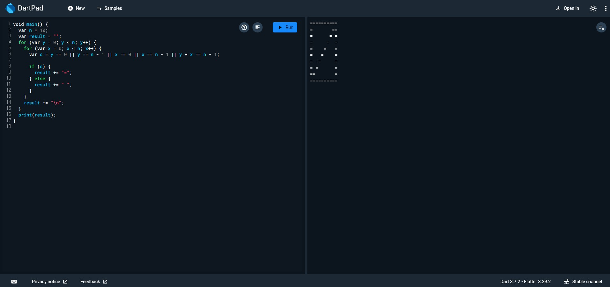

# Flutter_02-1
Android Studio & Flutter SDK
- Android Studio Meerkat | 2024.3.1 Windows
- Flutter_windows_3.29.1-stable
- https://dartpad.dev/

## 실습 내용
Dart 문법을 연습할수있는 [dartpad.dev](https://dartpad.dev/)를 활용하여 정사각형의 길이(n)를 입력하고 사각형을 출력해보기

작성 코드
<pre>
<code>
void main() {
  var n = 10;
  var result = "";
  for (var y = 0; y < n; y++) {
    for (var x = 0; x < n; x++) {
      var c = y == 0 || y == n - 1 || x == 0 || x == n - 1;

      if (c) {
        result += "=";
      } else {
        result += " ";
      }
    }
    result += "\n";
  }
  print(result);
}
</code>
</pre>

#### 실행 결과

## 실습 예제1
위에 출력했던 사각형에서 X 표시를 추가하기

작성 코드
<pre>
<code>
void main() {
  var n = 10;
  var result = "";

  for (var y = 0; y < n; y++) {
    for (var x = 0; x < n; x++) {
      var c = y == 0 || y == n - 1 || x == 0 || x == n - 1;
      var d = x == y || x + y == n - 1;

      if (c) {
        result += "=";
      } else if (d) {
        result += "=";
      } else {
        result += " ";
      }
    }
    result += "\n";
  }
  print(result);
}
</code>
</pre>

#### 실행 결과

## 실습 예제2
위에 출력했던 사각형에서 \ 방향 표시 추가하기

작성 코드
<pre>
<code>
void main() {
  var n = 10;
  var result = "";
  for (var y = 0; y < n; y++) {
    for (var x = 0; x < n; x++) {
      var c = y == 0 || y == n - 1 || x == 0 || x == n - 1 || y == x;
    
      if (c) {
        result += "=";
      } else {
        result += " ";
      }
    }
    result += "\n";
  }
  print(result);
}
</code>
</pre>

#### 실행 결과

## 실습 예제3
위에 출력했던 사각형에서 / 방향 표시 추가하기

작성 코드
<pre>
<code>
void main() {
  var n = 10;
  var result = "";
  for (var y = 0; y < n; y++) {
    for (var x = 0; x < n; x++) {
      var c = y == 0 || y == n - 1 || x == 0 || x == n - 1 || y + x == n - 1;

      if (c) {
        result += "=";
      } else {
        result += " ";
      }
    }
    result += "\n";
  }
  print(result);
}
</code>
</pre>

#### 실행 결과

## 실습 예제4
위에 출력했던 사각형에서 네모 안쪽을 다 채우기

작성 코드
<pre>
<code>
void main() {
  var n = 10;
  var result = "";
  for (var y = 0; y < n; y++) {
    for (var x = 0; x < n; x++) {
      var c = true;
      if (c) {
        result += "=";
      } else {
        result += " ";
      }
    }
    result += "\n";
  }
  print(result);
}
</code>
</pre>

#### 실행 결과

