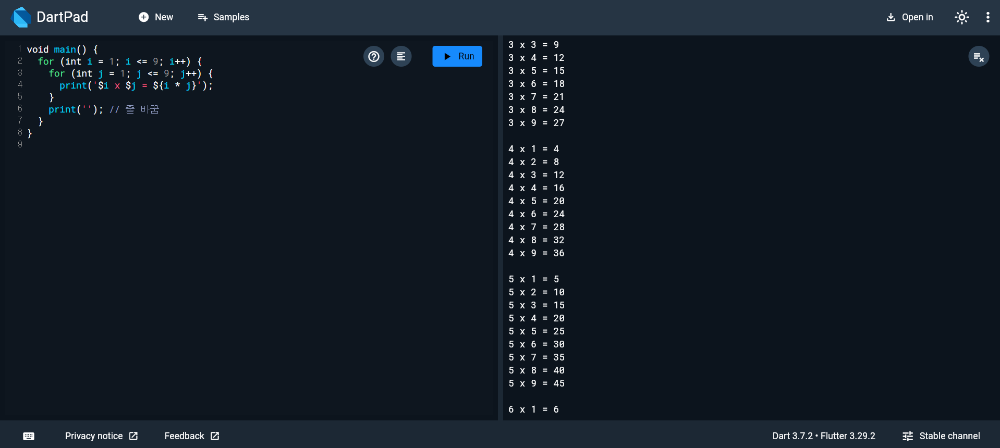

# Flutter_02-2
Android Studio & Flutter SDK
- Android Studio Meerkat | 2024.3.1 Windows
- Flutter_windows_3.29.1-stable
- https://dartpad.dev/

## 실습 내용
Dart 문법을 연습할수있는 [dartpad.dev](https://dartpad.dev/)를 활용하여 구구단 출력해보기기

작성 코드
<pre>
<code>
void main() {
  for (int i = 1; i <= 9; i++) {
    for (int j = 1; j <= 9; j++) {
      print('$i x $j = ${i * j}');
    }
    print(''); // 줄 바꿈
  }
}
</code>
</pre>

#### 실행 결과
