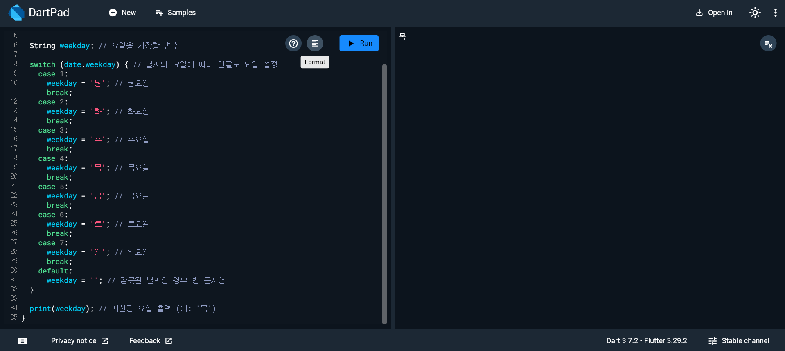

# Flutter_02-3
Android Studio & Flutter SDK
- Android Studio Meerkat | 2024.3.1 Windows
- Flutter_windows_3.29.1-stable
- https://dartpad.dev/

## 실습 내용
Dart 문법을 연습할수있는 [dartpad.dev](https://dartpad.dev/)를 활용하여 날짜(년-월-일)을 input 했을시 날짜에 맞는 요일 출력

작성 코드
<pre>
<code>
void main() {
  var input = '2025-03-20'; // 입력받은 날짜 문자열 (예: '2025-03-20')

  DateTime date = DateTime.parse(input); // 문자열을 DateTime 객체로 변환

  // DateTime.weekday는 1(월요일)에서 7(일요일)까지의 숫자를 반환
  String weekday; // 요일을 저장할 변수

  // date.weekday 값에 따라 해당 요일을 한글로 설정
  switch (date.weekday) {
    case 1:
      weekday = '월'; // 월요일
      break;
    case 2:
      weekday = '화'; // 화요일
      break;
    case 3:
      weekday = '수'; // 수요일
      break;
    case 4:
      weekday = '목'; // 목요일
      break;
    case 5:
      weekday = '금'; // 금요일
      break;
    case 6:
      weekday = '토'; // 토요일
      break;
    case 7:
      weekday = '일'; // 일요일
      break;
    default:
      weekday = ''; // 잘못된 날짜일 경우 빈 문자열
  }

  print(weekday); // 해당 날짜의 요일을 출력 (예: '화')
}
</code>
</pre>

### 실행 결과
