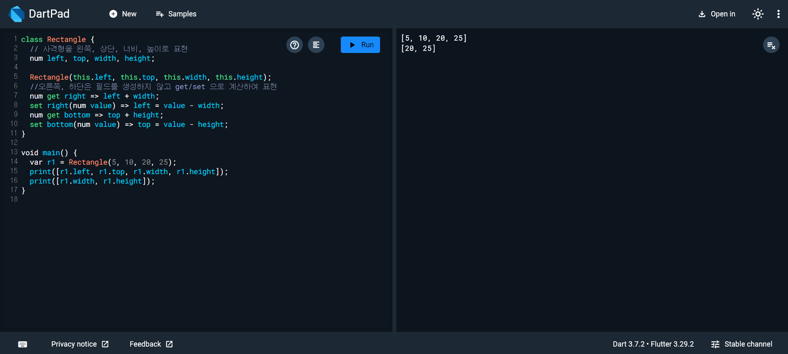
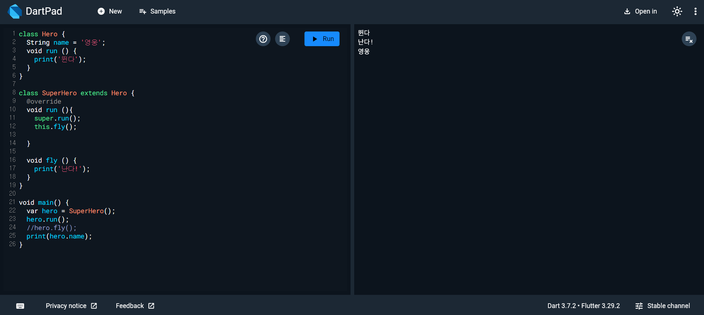
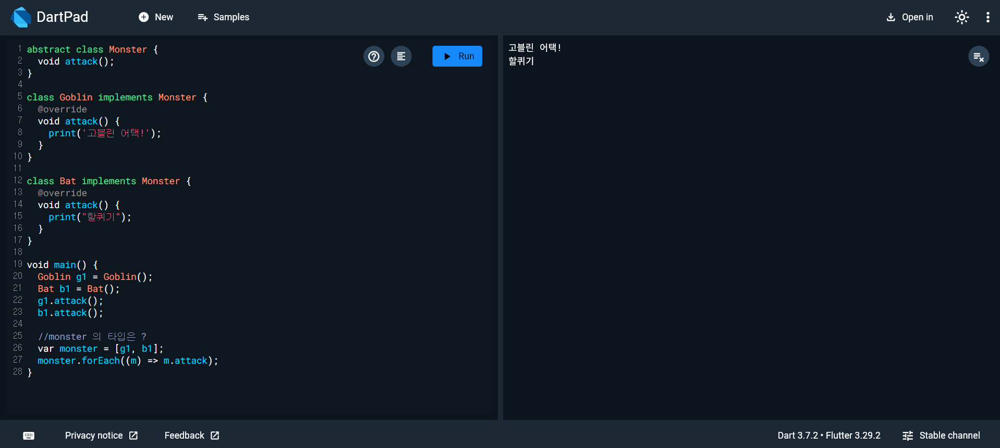

# Flutter_03-1
Android Studio & Flutter SDK
- Android Studio Meerkat | 2024.3.1 Windows
- Flutter_windows_3.29.1-stable
- https://dartpad.dev/

## 실습 내용
Dart 문법을 연습할수있는 [dartpad.dev](https://dartpad.dev/)를 활용하여 다양한 객체 지향 프로그래밍 코드 연습해보기

### 실습 예제 1

작성 코드
<pre>
<code>
class Rectangle {
  // 사격형을 왼쪽, 상단, 너비, 높이로 표현
  num left, top, width, height;

  Rectangle(this.left, this.top, this.width, this.height);
  //오른쪽, 하단은 필드를 생성하지 않고 get/set 으로 계산하여 표현
  num get right => left + width;
  set right(num value) => left = value - width;
  num get bottom => top + height;
  set bottom(num value) => top = value - height;
}

void main() {
  var r1 = Rectangle(5, 10, 20, 25);
  print([r1.left, r1.top, r1.width, r1.height]);
  print([r1.width, r1.height]);
}
</code>
</pre>

#### 실행 결과

### 실습 예제 2

작성 코드
<pre>
<code>
class Hero {
  String name = '영웅';
  void run () {
    print('뛴다');
  }
}

class SuperHero extends Hero {
  @override
  void run (){
    super.run();
    this.fly();
    
  }
  
  void fly () {
    print('난다!');
  }
}

void main() {
  var hero = SuperHero();
  hero.run();
  //hero.fly();
  print(hero.name);
}
</code>
</pre>

#### 실행 결과

 
### 실습 예제 3

작성 코드
<pre>
<code>
abstract class Monster {
  void attack();
}

class Goblin implements Monster {
  @override
  void attack() {
    print('고블린 어택!');
  }
}

class Bat implements Monster {
  @override
  void attack() {
    print("할퀴기");
  }
}

void main() {
  Goblin g1 = Goblin();
  Bat b1 = Bat();
  g1.attack();
  b1.attack();

  //monster 의 타입은 ?
  var monster = [g1, b1];
  monster.forEach((m) => m.attack);
}
</code>
</pre>

#### 실행 결과

