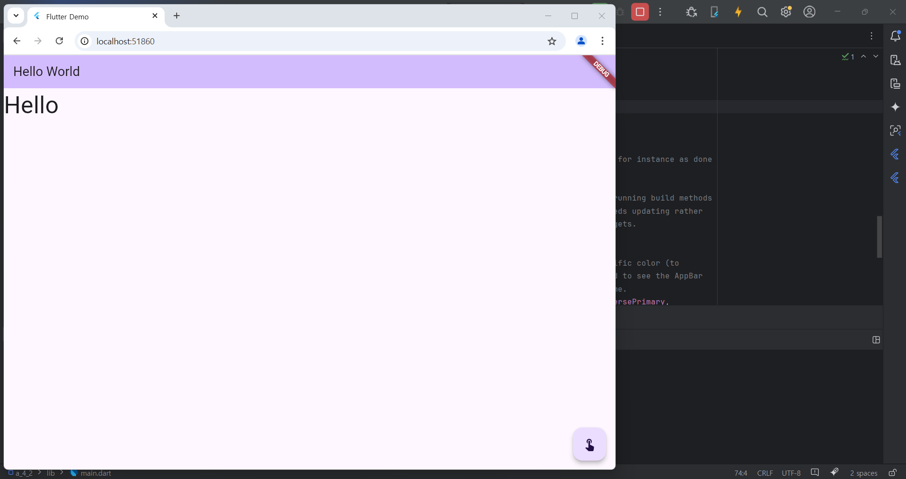
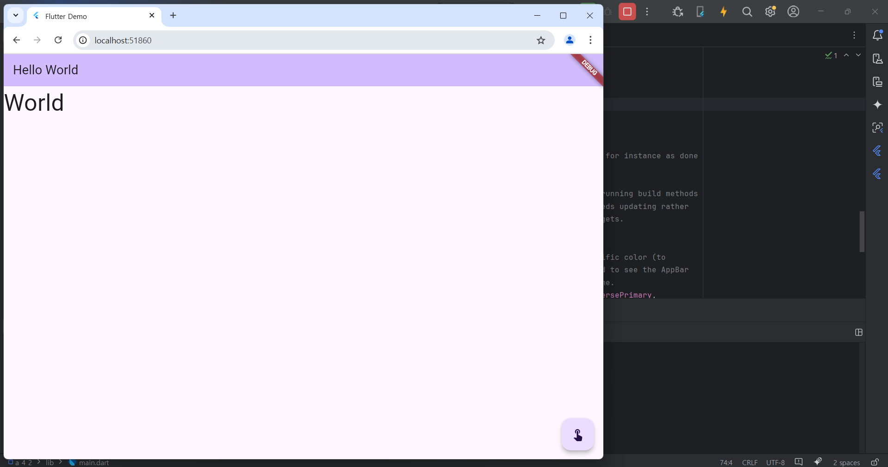

# Flutter_04-2
Android Studio & Flutter SDK
- Android Studio Meerkat | 2024.3.1 Windows
- Flutter_windows_3.29.1-stable
- https://dartpad.dev/

## 실습 내용
Android Studio 와 Flutter 를 활용하여 화면에 최초 Hello 문구 출력 후 버튼 클릭시 World, 다시 클릭시 Hello 로 바뀌는 프로그램 코딩

작성 코드

<pre>
<code>
import 'package:flutter/material.dart';

void main() {
  runApp(const MyApp());
}
class MyApp extends StatelessWidget {
  const MyApp({super.key});

  // This widget is the root of your application.
  @override
  Widget build(BuildContext context) {
    return MaterialApp(
      title: 'Flutter Demo',
      theme: ThemeData(
        colorScheme: ColorScheme.fromSeed(seedColor: Colors.deepPurple),
      ),
      home: const MyHomePage(title: 'Flutter Demo Home Page'),
    );
  }
}

class MyHomePage extends StatefulWidget {
  const MyHomePage({super.key, required this.title});

  final String title;

  @override
  State<MyHomePage> createState() => _MyHomePageState();
}

class _MyHomePageState extends State<MyHomePage> {

  var _text = 'Hello';
  var _isToogled = false;

  void _incrementCounter() {
    setState(() {
      _text = _isToogled ? 'Hello' : 'World';
      _isToogled = !_isToogled;
    });
  }

  @override
  Widget build(BuildContext context) {

    return Scaffold(
      appBar: AppBar(
        backgroundColor: Theme.of(context).colorScheme.inversePrimary,
        title: Text('Hello World'),
      ),
      body : Text(_text,
          style : TextStyle(fontSize : 40),
      ),
      floatingActionButton: FloatingActionButton(
        onPressed: _incrementCounter,
        tooltip: 'Increment',
        child: const Icon(Icons.touch_app),
      ), // This trailing comma makes auto-formatting nicer for build methods.
    );
  }
}
</code>
</pre>

#### 실행 결과

