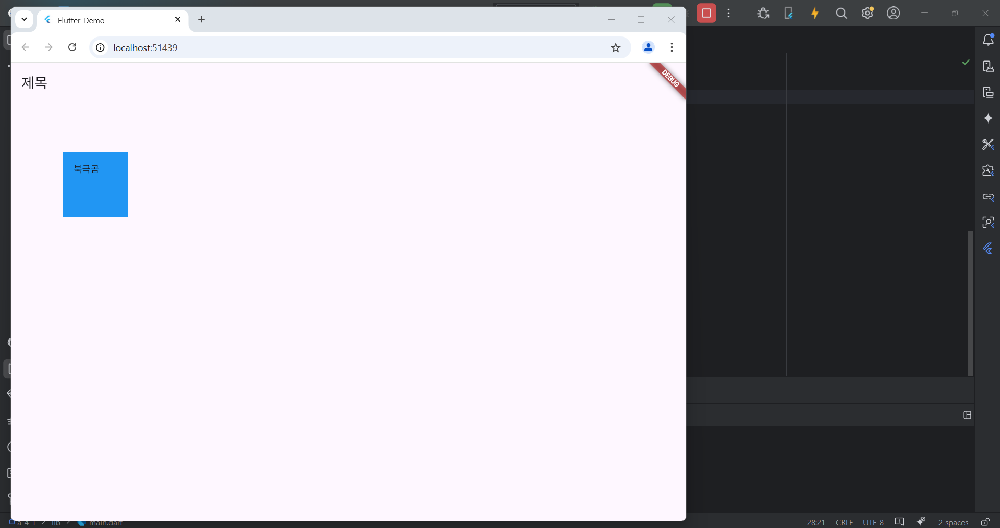

# Flutter_05-2
Android Studio & Flutter SDK
- Android Studio Meerkat | 2024.3.1 Windows
- Flutter_windows_3.29.1-stable
- https://dartpad.dev/

## 실습 내용
Android Studio 와 Flutter 를 활용하여 기본 위젯 예제 연습을 위한 코드 작성 후 실행해보기2

작성 코드

<pre>
<code>
import 'package:flutter/material.dart';

void main() {
  runApp(const MyApp());
}

class MyApp extends StatelessWidget {
  const MyApp({super.key});

  @override
  Widget build(BuildContext context) {
    return MaterialApp(
      title: 'Flutter Demo',
      theme: ThemeData(
        colorScheme: ColorScheme.fromSeed(seedColor: Colors.deepPurple),
      ),
      home: const MyHomePage(),
    );
  }
}

class MyHomePage extends StatelessWidget {
  const MyHomePage ({super.key});

  @override
  Widget build(BuildContext context) {
    return Scaffold(
        appBar: AppBar(
            title: Text('제목')
        ),
        body : Container(
          width: 100,
          height: 100,
          margin: EdgeInsets.all(80.0),
          padding: EdgeInsets.all(16.0),
          color: Colors.blue,
          child: Text('북극곰'),
        )
    );
  }
}
</code>
</pre>

#### 실행 결과

