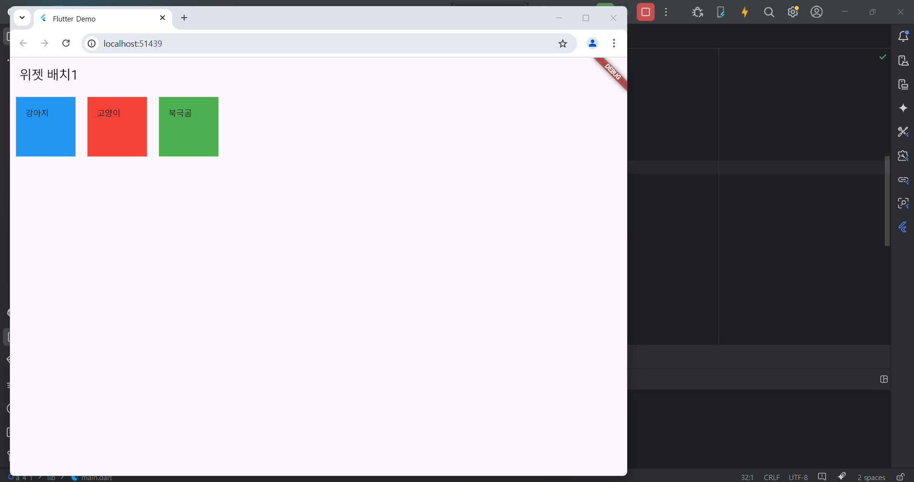
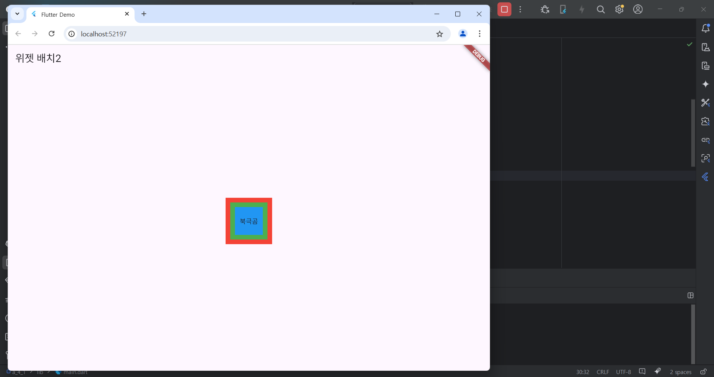

# Flutter_05-3
Android Studio & Flutter SDK
- Android Studio Meerkat | 2024.3.1 Windows
- Flutter_windows_3.29.1-stable
- https://dartpad.dev/

## 실습 내용
Android Studio 와 Flutter 를 활용하여 기본 위젯 예제 연습을 위한 코드 작성 및 위젯 배치해보기

### 실습 예제 1

작성 코드
<pre>
<code>
import 'package:flutter/material.dart';

void main() {
  runApp(const MyApp());
}

class MyApp extends StatelessWidget {
  const MyApp({super.key});

  @override
  Widget build(BuildContext context) {
    return MaterialApp(
      title: 'Flutter Demo',
      theme: ThemeData(
        colorScheme: ColorScheme.fromSeed(seedColor: Colors.deepPurple),
      ),
      home: const MyHomePage(),
    );
  }
}

class MyHomePage extends StatelessWidget {
  const MyHomePage ({super.key});

  @override
  Widget build(BuildContext context) {
    return Scaffold(
      appBar: AppBar(
          title: Text('위젯 배치1')
      ),

      body: Row(
          children : [
            Container(
              width: 100,
              height: 100,
              margin: EdgeInsets.all(10.0),
              padding: EdgeInsets.all(16.0),
              color: Colors.blue,
              child: Text('강아지'),
            ),
            Container(
              width: 100,
              height: 100,
              margin: EdgeInsets.all(10.0),
              padding: EdgeInsets.all(16.0),
              color: Colors.red,
              child: Text('고양이'),
            ),
            Container(
              width: 100,
              height: 100,
              margin: EdgeInsets.all(10.0),
              padding: EdgeInsets.all(16.0),
              color: Colors.green,
              child: Text('북극곰'),
            ),
          ]
      ),
    );
  }
}
</code>
</pre>

#### 실행 결과

### 실습 예제 2

작성 코드
<pre>
<code>
import 'package:flutter/material.dart';

void main() {
  runApp(const MyApp());
}

class MyApp extends StatelessWidget {
  const MyApp({super.key});

  @override
  Widget build(BuildContext context) {
    return MaterialApp(
      title: 'Flutter Demo',
      theme: ThemeData(
        colorScheme: ColorScheme.fromSeed(seedColor: Colors.deepPurple),
      ),
      home: const MyHomePage(),
    );
  }
}

class MyHomePage extends StatelessWidget {
  const MyHomePage ({super.key});

  @override
  Widget build(BuildContext context) {
    return Scaffold(
      appBar: AppBar(
        title: Text('위젯 배치2')
      ),
      
      body: Stack(
        children: [
          Center(
              child : Container(
                color: Colors.red,
                width: 100,
                height: 100,
                padding: const EdgeInsets.all(8.0),
                margin: const EdgeInsets.all(8.0),
              )
          ),
          Center(
              child : Container(
                color: Colors.green,
                width: 80,
                height: 80,
                padding: const EdgeInsets.all(8.0),
                margin: const EdgeInsets.all(8.0),
              )
          ),
          Center(
              child : Container(
                color: Colors.blue,
                width: 60,
                height: 60,
                padding: const EdgeInsets.all(8.0),
                margin: const EdgeInsets.all(8.0),
                child: Center(child : Text('북극곰')),
              )
          )
        ],
      ),
      );
  }
}
</code>
</pre>

#### 실행 결과

