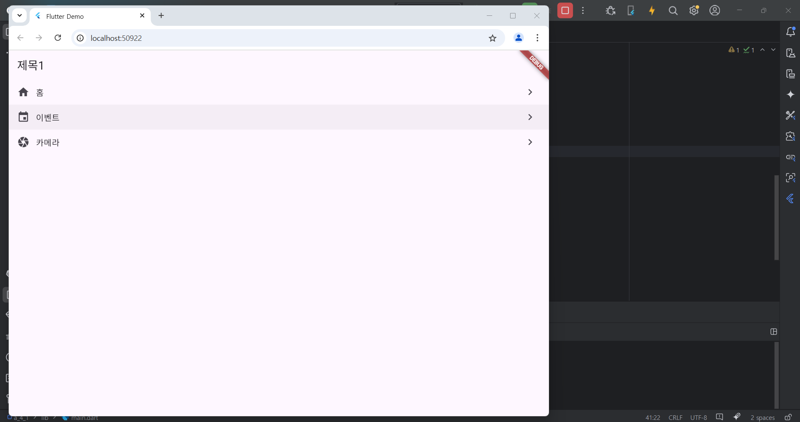

# Flutter_05-4
Android Studio & Flutter SDK
- Android Studio Meerkat | 2024.3.1 Windows
- Flutter_windows_3.29.1-stable
- https://dartpad.dev/

## 실습 내용
Android Studio 와 Flutter 를 활용하여 화면에 아이콘과 버튼 출력 후 클릭해보기 (클릭시 효과만 발생, 작동 X)

작성 코드

<pre>
<code>
import 'package:flutter/material.dart';

void main() {
  runApp(const MyApp());
}

class MyApp extends StatelessWidget {
  const MyApp({super.key});

  @override
  Widget build(BuildContext context) {
    return MaterialApp(
      title: 'Flutter Demo',
      theme: ThemeData(
        colorScheme: ColorScheme.fromSeed(seedColor: Colors.deepPurple),
      ),
      home: MyHomePage(),
    );
  }
}
class MyHomePage extends StatelessWidget {
  final items = List.generate(100, (i) => i).toList();

  @override
  Widget build(BuildContext context) {
    return Scaffold(
        appBar: AppBar(
            title: Text('제목1')
        ),

        body : ListView(
          scrollDirection: Axis.vertical,
          children: [
            ListTile(
              leading: Icon(Icons.home),
              title : Text('홈'),
              trailing: Icon(Icons.navigate_next),
              onTap: () {},
            ),
            ListTile(
              leading: Icon(Icons.event),
              title : Text('이벤트'),
              trailing: Icon(Icons.navigate_next),
              onTap: () => {
                // XXXX
              },
            ),
            ListTile(
              leading: Icon(Icons.camera),
              title : Text('카메라'),
              trailing: Icon(Icons.navigate_next),
              onTap: () {},
            ),
          ],
        )
    );
  }
}
</code>
</pre>

#### 실행 결과

