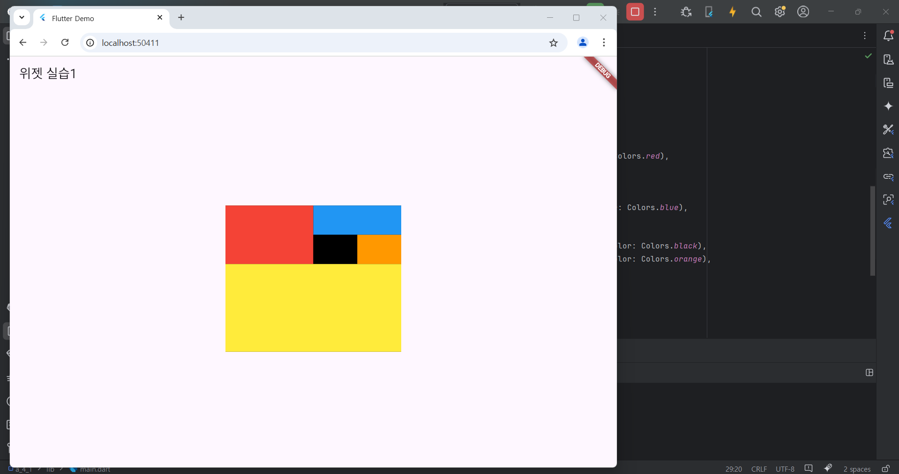

# Flutter_05-5
Android Studio & Flutter SDK
- Android Studio Meerkat | 2024.3.1 Windows
- Flutter_windows_3.29.1-stable
- https://dartpad.dev/

## 실습 내용
Android Studio 와 Flutter 를 활용하여 화면에 Container 구성 후 각 구역마다 색상 배치하기기

작성 코드

<pre>
<code>
import 'package:flutter/material.dart';

void main() {
  runApp(const MyApp());
}

class MyApp extends StatelessWidget {
  const MyApp({super.key});

  @override
  Widget build(BuildContext context) {
    return MaterialApp(
      title: 'Flutter Demo',
      theme: ThemeData(
        colorScheme: ColorScheme.fromSeed(seedColor: Colors.deepPurple),
      ),
      home: const MyHomePage(),
    );
  }
}

class MyHomePage extends StatelessWidget {
  const MyHomePage({super.key});

  @override
  Widget build(BuildContext context) {
    return Scaffold(
      appBar: AppBar(title: const Text('위젯실습1')),
      body: Center(
        child: Container(
          width: 300,
          height: 250,
          color: Colors.black, // 외곽선 느낌
          child: Column(
            children: [
              Row(
                children: [
                  // 왼쪽 RED
                  Container(width: 150, height: 100, color: Colors.red),
                  // 오른쪽 BLUE + (BLACK + ORANGE)
                  Column(
                    children: [
                      Container(width: 150, height: 50, color: Colors.blue),
                      Row(
                        children: [
                          Container(width: 75, height: 50, color: Colors.black),
                          Container(width: 75, height: 50, color: Colors.orange),
                        ],
                      )
                    ],
                  ),
                ],
              ),
              // 아래 YELLOW
              Container(width: 300, height: 150, color: Colors.yellow),
            ],
          ),
        ),
      ),
    );
  }
}
</code>
</pre>

#### 실행 결과

