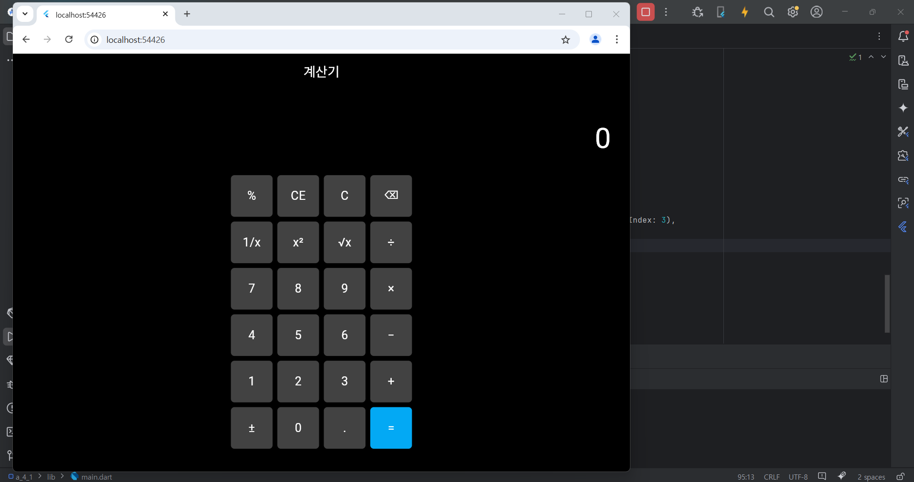

# Flutter_05-7
Android Studio & Flutter SDK
- Android Studio Meerkat | 2024.3.1 Windows
- Flutter_windows_3.29.1-stable
- https://dartpad.dev/

## 실습 내용
Android Studio 와 Flutter 를 활용하여 화면에 Container 를 활용하여 계산기 외관 구현하기

작성 코드

<pre>
<code>
import 'package:flutter/material.dart';

void main() => runApp(const MyApp());

class MyApp extends StatelessWidget {
  const MyApp({super.key});

  @override
  Widget build(BuildContext context) {
    return MaterialApp(
      debugShowCheckedModeBanner: false,
      home: const CalculatorUIContainerOnly(),
    );
  }
}

class CalculatorUIContainerOnly extends StatelessWidget {
  const CalculatorUIContainerOnly({super.key});

  // 버튼 하나 생성
  Widget buildCalcButton(String label, {Color? color}) {
    return Container(
      width: 70,
      height: 70,
      margin: const EdgeInsets.all(4),
      decoration: BoxDecoration(
        color: color ?? Colors.grey[800],
        borderRadius: BorderRadius.circular(6),
      ),
      alignment: Alignment.center,
      child: Text(
        label,
        style: const TextStyle(fontSize: 20, color: Colors.white),
      ),
    );
  }

  // 한 줄 버튼 생성
  Widget buildButtonRow(List<String> labels, {int highlightIndex = -1}) {
    return Row(
      mainAxisAlignment: MainAxisAlignment.center,
      children: List.generate(labels.length, (index) {
        return buildCalcButton(
          labels[index],
          color: (highlightIndex == index) ? Colors.lightBlue : null,
        );
      }),
    );
  }

  @override
  Widget build(BuildContext context) {
    return Scaffold(
      backgroundColor: Colors.black,
      appBar: AppBar(
        title: const Text('계산기'),
        backgroundColor: Colors.black,
        foregroundColor: Colors.white,
        centerTitle: true,
        elevation: 0,
      ),
      body: Center(
        child: Container(
          padding: const EdgeInsets.all(16),
          decoration: BoxDecoration(
            color: Colors.black87,
            borderRadius: BorderRadius.circular(8),
          ),
          child: Column(
            mainAxisSize: MainAxisSize.min,
            children: [
              // 결과창
              Container(
                width: double.infinity,
                padding: const EdgeInsets.all(16),
                alignment: Alignment.centerRight,
                child: const Text(
                  '0',
                  style: TextStyle(
                    fontSize: 48,
                    color: Colors.white,
                  ),
                ),
              ),
              const SizedBox(height: 8),

              // 버튼들
              buildButtonRow(['%', 'CE', 'C', '⌫']),
              buildButtonRow(['1/x', 'x²', '√x', '÷']),
              buildButtonRow(['7', '8', '9', '×']),
              buildButtonRow(['4', '5', '6', '−']),
              buildButtonRow(['1', '2', '3', '+']),
              buildButtonRow(['±', '0', '.', '='], highlightIndex: 3),
            ],
          ),
        ),
      ),
    );
  }
}
</code>
</pre>

#### 실행 결과

