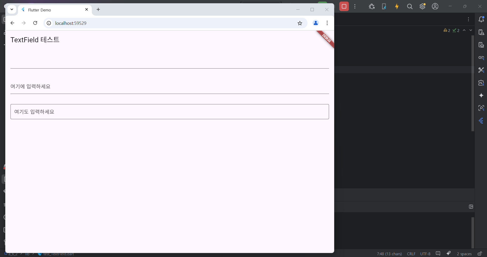
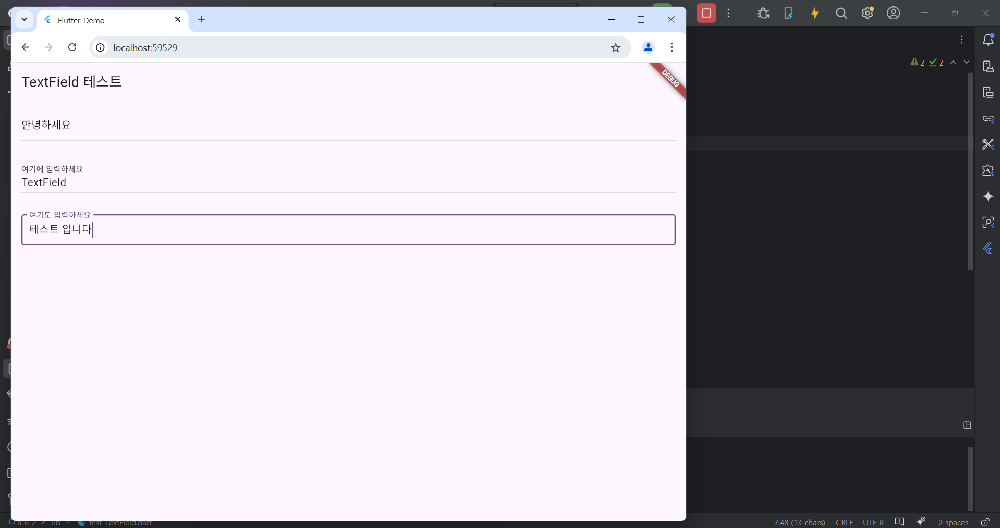

# Flutter_06-1
Android Studio & Flutter SDK
- Android Studio Meerkat | 2024.3.1 Windows
- Flutter_windows_3.29.1-stable
- https://dartpad.dev/

## 실습 내용
Android Studio 와 Flutter 를 활용하여 화면에 TextField 출력 후 입력해보기

main.dart 작성 코드

<pre>
<code>
import 'package:flutter/material.dart';

import 'package:a_6_2/test_TextField.dart';

void main() {
  runApp(const MyApp());
}

class MyApp extends StatelessWidget {
  const MyApp({super.key});

  // This widget is the root of your application.
  @override
  Widget build(BuildContext context) {
    return MaterialApp(
      title: 'Flutter Demo',
      theme: ThemeData(
        colorScheme: ColorScheme.fromSeed(seedColor: Colors.deepPurple),
      ),
      home:TestTextField(),
    );
  }
}
</code>
</pre>

test_TextField.dart 작성 코드

<pre>
<code>
import 'package:flutter/material.dart';

class TestTextField extends StatelessWidget {
  @override
  Widget build(BuildContext context) {
    return Scaffold(
      appBar: AppBar(title: Text('TextField 테스트')),
      body: Padding(
        padding: EdgeInsets.all(16.0),
        child: Column(
          children: [
            TextField(),

            SizedBox(height: 32,),

            TextField(decoration: InputDecoration(labelText: '여기에 입력하세요')),

            SizedBox(height: 32,),
            
            TextField(
              decoration: InputDecoration(
                border: OutlineInputBorder(),
                labelText: '여기도 입력하세요',
              ),
            ),
          ],
        ),
      ),
    );
  }
}

</code>
</pre>

#### 실행 결과

