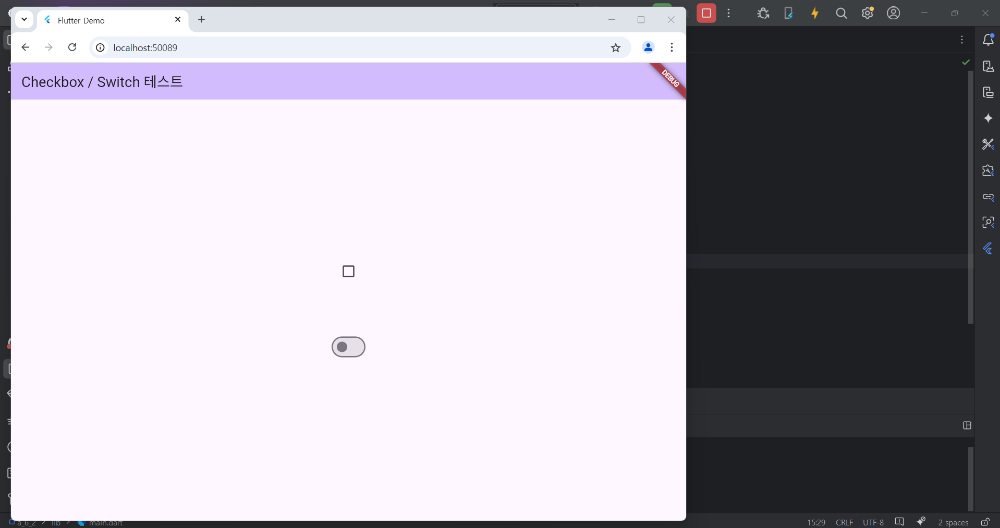
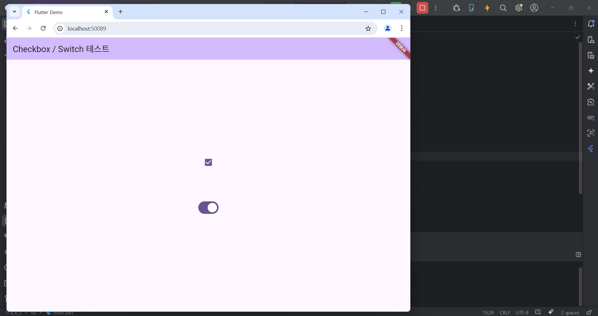

# Flutter_06-3
Android Studio & Flutter SDK
- Android Studio Meerkat | 2024.3.1 Windows
- Flutter_windows_3.29.1-stable
- https://dartpad.dev/

## 실습 내용
Android Studio 와 Flutter 를 활용하여 화면에 Checkbox 출력 후 체크해보기

main.dart 작성 코드

<pre>
<code>
import 'package:flutter/material.dart';
import 'package:a_6_2/test_CheckBox.dart';

void main() {
  runApp(const MyApp());
}

class MyApp extends StatelessWidget {
  const MyApp({super.key});

  // This widget is the root of your application.
  @override
  Widget build(BuildContext context) {
    return MaterialApp(
      title: 'Flutter Demo',
      theme: ThemeData(
        colorScheme: ColorScheme.fromSeed(seedColor: Colors.deepPurple),
      ),
      // home:TestTextField(),
      home:TestCheckBox(),
    );
  }
}

</code>
</pre>

test_TextField.dart 작성 코드

<pre>
<code>
import 'package:flutter/material.dart';

class TestCheckBox extends StatefulWidget {
  const TestCheckBox({super.key});

  @override
  State<TestCheckBox> createState() => _CheckboxState();
}

class _CheckboxState extends State<TestCheckBox> {
  bool? isChecked1 = false;
  bool isChecked2 = false;

  @override
  Widget build(BuildContext context) {
    return Scaffold(
      appBar: AppBar(
        backgroundColor: Theme.of(context).colorScheme.inversePrimary,
        title: Text('Checkbox / Switch 테스트'),
      ),
      body: Center(
        child: Column(
          mainAxisAlignment: MainAxisAlignment.center,
          children: [
            Checkbox(
              value: isChecked1,
              onChanged: (value) {
                setState(() {
                  isChecked1 = value;
                });
              },
            ),
            SizedBox(height: 80),

            Switch(
              value: isChecked2,
              onChanged: (value) {
                setState(() {
                  isChecked2 = value;
                });
              },
            ),
          ],
        ),
      ),
    );
  }
}

</code>
</pre>

#### 실행 결과

