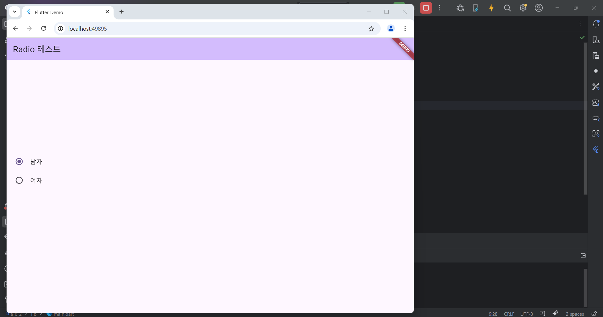
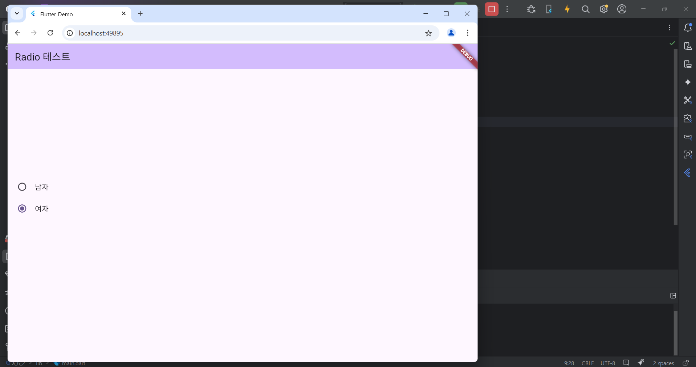

# Flutter_06-4
Android Studio & Flutter SDK
- Android Studio Meerkat | 2024.3.1 Windows
- Flutter_windows_3.29.1-stable
- https://dartpad.dev/

## 실습 내용
Android Studio 와 Flutter 를 활용하여 화면에 Radio 버튼 출력 후 클릭해서 확인해보기

main.dart 작성 코드

<pre>
<code>
import 'package:flutter/material.dart';
import 'package:a_6_2/test_Radio.dart';

void main() {
  runApp(const MyApp());
}

class MyApp extends StatelessWidget {
  const MyApp({super.key});

  // This widget is the root of your application.
  @override
  Widget build(BuildContext context) {
    return MaterialApp(
      title: 'Flutter Demo',
      theme: ThemeData(
        colorScheme: ColorScheme.fromSeed(seedColor: Colors.deepPurple),
      ),
      // home:TestTextField(),
      home:TestRadio(),
    );
  }
}

</code>
</pre>

test_Radio.dart 작성 코드

<pre>
<code>
import 'package:flutter/material.dart';

enum Gender { MAN, WOMAN, }

class TestRadio extends StatefulWidget {
  const TestRadio({super.key});

  @override
  State<TestRadio> createState() => _RadioState();
}

class _RadioState extends State<TestRadio> {
  Gender _gender = Gender.MAN;

  @override
  Widget build(BuildContext context) {
    return Scaffold(
      appBar: AppBar(
        backgroundColor: Theme.of(context).colorScheme.inversePrimary,
        title: Text('Radio 테스트'),
      ),
      body: Center(
        child: Column(
          mainAxisAlignment: MainAxisAlignment.center,
          children: [
            ListTile(
              title: Text('남자'),
              leading: Radio(
                value: Gender.MAN,
                groupValue: _gender,
                onChanged: (value) {
                  setState(() {
                    _gender = value!;
                  });
                },
              ),
            ),
            ListTile(
              title: Text('여자'),
              leading: Radio(
                value: Gender.WOMAN,
                groupValue: _gender,
                onChanged: (value) {
                  setState(() {
                    _gender = value!;
                  });
                },
              ),
            ),

            SizedBox(height : 80),
          ],
        ),
      ),
    );
  }
}

</code>
</pre>

#### 실행 결과

