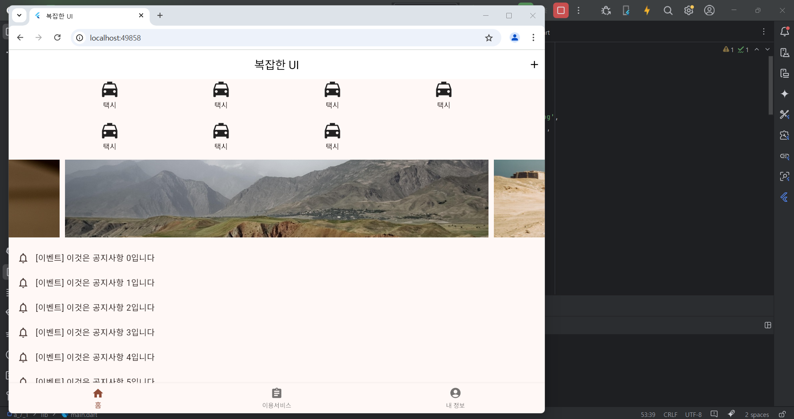
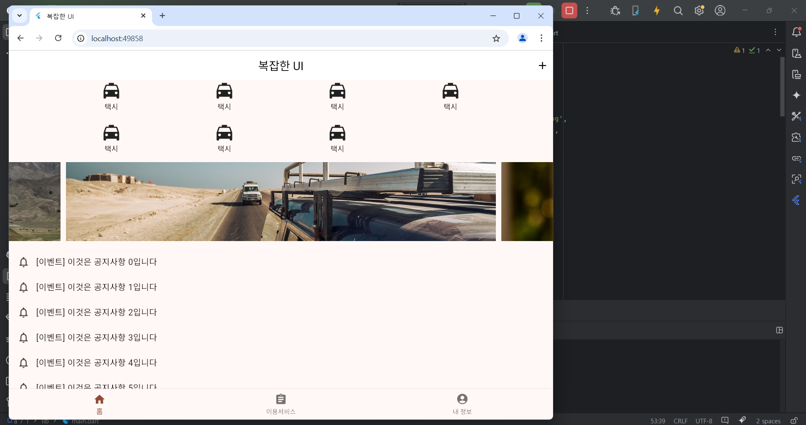
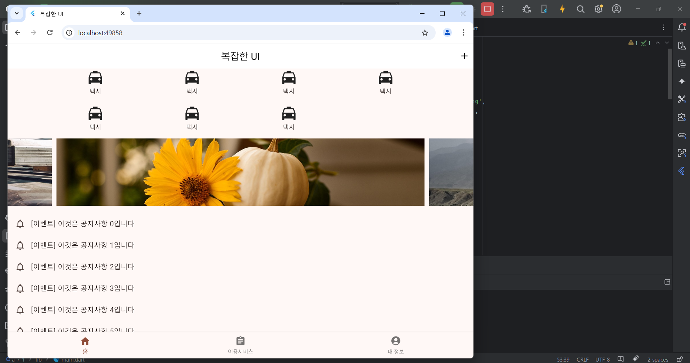
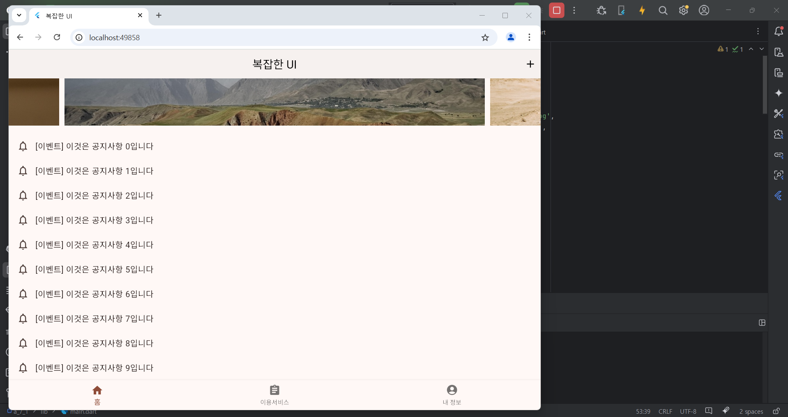

# Flutter_07-1
Android Studio & Flutter SDK
- Android Studio Meerkat | 2024.3.1 Windows
- Flutter_windows_3.29.1-stable
- https://dartpad.dev/

## 실습 내용
Android Studio 와 Flutter 를 활용하여 화면에 UI 구성 후 화면을 단계적으로 구성해보기 
뼈대, 하단 탭 구성 후 첫번째 화면 구성해보기(두, 세번째 화면은 추후 구성 예정정)

main.dart 작성 코드

<pre>
<code>
import 'package:flutter/material.dart';
import 'package:a_7_1/page1.dart';
import 'package:a_7_1/page2.dart';
import 'package:a_7_1/page3.dart';

final dummyItems = [
  'https://cdn.pixabay.com/photo/2018/11/12/18/44/thanksgiving-3811492_1280.jpg',
  'https://cdn.pixabay.com/photo/2019/10/30/15/33/tajikistan-4589831_1280.jpg',
  'https://cdn.pixabay.com/photo/2019/11/25/16/15/sfari-4652364_1280.jpg',
];

void main() {
  runApp(const MyApp());
}

class MyApp extends StatelessWidget {
  const MyApp({super.key});

  // This widget is the root of your application.
  @override
  Widget build(BuildContext context) {
    return MaterialApp(
      title: '복잡한 UI',
      theme: ThemeData(

        colorScheme: ColorScheme.fromSeed(seedColor: Colors.deepOrange),
      ),
      home: const MyHomePage(),
      debugShowCheckedModeBanner: false,
    );
  }
}

class MyHomePage extends StatefulWidget {
  const MyHomePage({super.key});

  @override
  State<MyHomePage> createState() => _MyHomePageState();
}

class _MyHomePageState extends State<MyHomePage> {

  var _index = 0;
  var _pages = [
    Page1(),
    Page2(),
    Page3(),
  ];

  @override
  Widget build(BuildContext context) {
    return Scaffold(
        appBar: AppBar(
          backgroundColor: Colors.white,
          title: Text('복잡한 UI', style: TextStyle(color: Colors.black),),
          centerTitle: true,
          actions: [
        IconButton(icon: Icon(Icons.add, color: Colors.black,),
        onPressed: () {},
    )
    ],
    ),
    //body: Center(child: Text('$_index 페이지',style: TextStyle(fontSize: 40),),),
    body: _pages[_index],
      bottomNavigationBar: BottomNavigationBar(
    currentIndex: _index,
    items: [
    BottomNavigationBarItem(label: '홈', icon: Icon(Icons.home),),
    BottomNavigationBarItem(label: '이용서비스', icon: Icon(Icons.assignment),),
    BottomNavigationBarItem(label: '내 정보', icon: Icon(Icons.account_circle),),
    ],
    onTap: (index) {
    setState(() {
    _index = index;
    });
    },
    )
    ,
    );
  }
}

</code>
</pre>

page1.dart 작성 코드

<pre>
<code>
import 'package:a_7_1/main.dart';
import 'package:flutter/material.dart';
import 'package:carousel_slider/carousel_slider.dart';

class Page1 extends StatelessWidget {
  @override
  Widget build(BuildContext context) {
    return SingleChildScrollView(
      child: Column(
        children: [
          _buildTop(),
          SizedBox(height: 16),
          _buildMiddle(),
          SizedBox(height: 16),
          _buildBottom(),
        ],
      ),
    );
  }

}

  Widget _buildTop() {
    return Column(
      children: [
        Row(
          mainAxisAlignment: MainAxisAlignment.spaceEvenly,
          children: [
            _buildTaxiMenu(),
            _buildTaxiMenu(),
            _buildTaxiMenu(),
            _buildTaxiMenu(),
          ],
        ),
        SizedBox(height: 20,),
        Row(
          mainAxisAlignment: MainAxisAlignment.spaceEvenly,
          children: [
            _buildTaxiMenu(),
            _buildTaxiMenu(),
            _buildTaxiMenu(),
            _buildTaxiMenu(visible : false),
          ],
        ),
      ],
      );
  }

  Widget _buildTaxiMenu({bool visible = true}) {
    return Opacity(
      opacity: visible ? 1.0 : 0.0,
      child:
      InkWell(
        onTap : () {},
        child : Column(children: [Icon(Icons.local_taxi, size: 40,), Text('택시')]),
      ),
    );
  }

  Widget _buildMiddle() {
    return CarouselSlider(
      items :
      dummyItems.map((url) {
        return Builder(
          builder: (BuildContext context) {
            return Container(
              width: MediaQuery.of(context).size.width,
              margin: EdgeInsets.symmetric(horizontal : 5.0),
              child: Image.network(url, fit:BoxFit.cover),
            );
          },
        );
      }).toList(),
      options : CarouselOptions(height : 150.0, autoPlay : true),
    );
  }

  Widget _buildBottom() {
    final items = List.generate(10, (i) {
      return ListTile(
        leading: Icon(Icons.notifications_none),
        title: Text('[이벤트] 이것은 공지사항 $i입니다'),
      );
    });

    return ListView(
      physics: NeverScrollableScrollPhysics(),
      children: items,
      shrinkWrap: true,
    );
  }

</code>
</pre>

#### 실행 결과

